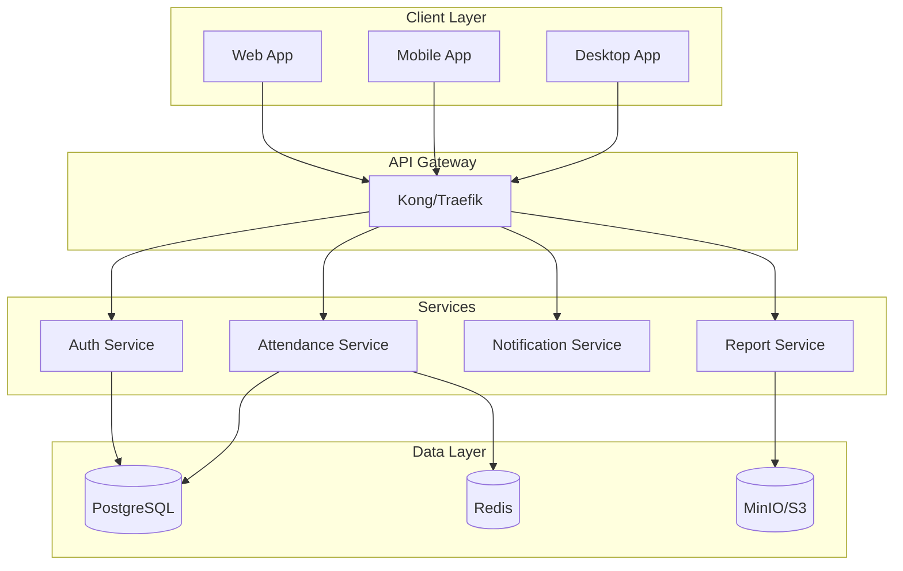

# 📋 ABSENIN - Sistem Presensi Open Source Modern

## 🎯 Ringkasan Proyek

**Nama Proyek:** Absenin  
**Tagline:** "Sistem Presensi yang Tenang dan Manusiawi"  
**Lisensi:** MIT License  
**Bahasa:** Indonesia  
**Status:** Open Source

### Deskripsi
Absenin adalah sistem presensi digital modern yang dirancang untuk menciptakan pengalaman presensi yang lebih tenang, fleksibel, dan manusiawi untuk perusahaan, institusi pendidikan, dan berbagai jenis bisnis.

---

## 📚 Daftar Isi

1. [Visi & Misi](#visi--misi)
2. [Fitur Utama](#fitur-utama)
3. [Arsitektur Teknis](#arsitektur-teknis)
4. [Roadmap Pengembangan](#roadmap-pengembangan)
5. [Tim & Kontributor](#tim--kontributor)
6. [Panduan Kontribusi](#panduan-kontribusi)

---

## 🌟 Visi & Misi

### Visi
Menciptakan ekosistem presensi digital yang menghargai privasi, fleksibilitas, dan kesejahteraan pengguna.

### Misi
- ✅ Menyediakan solusi presensi yang dapat disesuaikan sepenuhnya
- ✅ Mengurangi stres dan kecemasan terkait sistem presensi
- ✅ Mendukung berbagai metode kerja (WFO, WFH, Hybrid)
- ✅ Membangun komunitas open source Indonesia yang aktif

---

## 🚀 Fitur Utama

### 1. Modul Inti

#### 📱 **Multi-Platform**
```
- Web Progressive App (PWA)
- Aplikasi Mobile (iOS & Android)
- Desktop App (Windows, Mac, Linux)
- Terminal/CLI Interface
- API REST & GraphQL
```

#### 🔐 **Metode Presensi**
```
- Pengenalan Wajah (dengan consent)
- QR Code Dinamis
- NFC/RFID
- Geolocation dengan Radius Fleksibel
- PIN/Password
- Biometrik (Fingerprint)
- Voice Recognition
- Presensi Manual dengan Persetujuan
```

### 2. Fitur Lanjutan

#### 🎨 **Kustomisasi Penuh**
```yaml
Tema & Branding:
  - Logo & warna perusahaan
  - Custom domain
  - Email template
  - Notification style

Workflow:
  - Aturan presensi custom
  - Approval chain
  - Shift patterns
  - Holiday management
```

#### 🧘 **Fitur "Calmer" (Lebih Tenang)**
```yaml
Wellness Features:
  - Mode "Tidak Mengganggu"
  - Reminder yang sopan
  - Grace period (toleransi waktu)
  - Absence reason tanpa judgment
  - Mental health day option
  - Flexible hours tracking

Privacy First:
  - Data minimization
  - End-to-end encryption option
  - GDPR/UU PDP compliant
  - Right to be forgotten
```

### 3. Modul Bisnis

#### 🏢 **Untuk Perusahaan**
- Manajemen multi-cabang
- Integrasi dengan sistem HR/Payroll
- Timesheet & project tracking
- Overtime calculation
- Leave management
- Performance metrics

#### 🎓 **Untuk Pendidikan**
- Manajemen kelas
- Jadwal pelajaran
- Integrasi dengan LMS
- Parent notification
- Student analytics
- Attendance certificate

#### 🏪 **Untuk Bisnis Kecil**
- Simplified interface
- Shift scheduling
- Basic payroll calculation
- Customer check-in
- Appointment system

---

## 🛠 Arsitektur Teknis

### Tech Stack

#### **Backend**
```yaml
Core:
  - Node.js + TypeScript
  - NestJS Framework
  - PostgreSQL (Primary DB)
  - Redis (Cache & Queue)
  - MinIO (Object Storage)

Microservices:
  - Authentication Service
  - Attendance Service
  - Notification Service
  - Report Service
  - Analytics Service
```

#### **Frontend**
```yaml
Web:
  - Next.js 14 + TypeScript
  - TailwindCSS + shadcn/ui
  - Zustand (State Management)
  - React Query
  - PWA Support

Mobile:
  - React Native / Flutter
  - Native modules untuk biometrik
```

#### **Infrastructure**
```yaml
Deployment:
  - Docker & Docker Compose
  - Kubernetes ready
  - CI/CD dengan GitHub Actions
  - Terraform untuk IaC

Monitoring:
  - Prometheus + Grafana
  - ELK Stack
  - Sentry untuk error tracking
```

### Diagram Arsitektur



---

## 📅 Roadmap Pengembangan

### Phase 1: Foundation (Q1 2024)
- [x] Project setup & repository
- [x] Core architecture design
- [ ] Basic authentication
- [ ] Simple attendance check-in/out
- [ ] Web interface MVP
- [ ] Documentation setup

### Phase 2: Core Features (Q2 2024)
- [ ] Mobile app development
- [ ] Multiple attendance methods
- [ ] Leave management
- [ ] Basic reporting
- [ ] Multi-language support
- [ ] Docker deployment

### Phase 3: Advanced Features (Q3 2024)
- [ ] Face recognition
- [ ] Analytics dashboard
- [ ] Integration APIs
- [ ] Customization engine
- [ ] Plugin system
- [ ] Performance optimization

### Phase 4: Enterprise Ready (Q4 2024)
- [ ] Multi-tenant architecture
- [ ] Advanced security features
- [ ] Compliance modules
- [ ] SLA monitoring
- [ ] Backup & disaster recovery
- [ ] Cloud marketplace deployment

---

## 👥 Tim & Kontributor

### Core Team Structure

```
📋 Project Lead
├── 🎨 UI/UX Team
│   ├── UI Designer
│   ├── UX Researcher
│   └── Frontend Developer
├── 💻 Backend Team
│   ├── Backend Lead
│   ├── Database Engineer
│   └── DevOps Engineer
├── 📱 Mobile Team
│   ├── iOS Developer
│   └── Android Developer
├── 🔒 Security Team
│   └── Security Analyst
├── 📚 Documentation Team
│   ├── Technical Writer
│   └── Community Manager
└── 🧪 QA Team
    ├── QA Lead
    └── Test Engineer
```

---

## 🤝 Panduan Kontribusi

### Cara Berkontribusi

1. **Fork & Clone**
```bash
git clone https://github.com/yourusername/absenin.git
cd absenin
```

2. **Setup Development Environment**
```bash
# Install dependencies
npm install

# Setup database
docker-compose up -d postgres redis

# Run migrations
npm run migration:run

# Start development
npm run dev
```

3. **Buat Branch Baru**
```bash
git checkout -b feature/nama-fitur
```

4. **Koding dengan Standard**
```yaml
Code Style:
  - ESLint + Prettier
  - Conventional Commits
  - Test Coverage > 80%
  
Documentation:
  - JSDoc untuk fungsi
  - README untuk setiap modul
  - Changelog update
```

5. **Submit Pull Request**
- Deskripsi yang jelas
- Screenshot/video demo
- Test passing
- Code review dari 2 maintainer

### Jenis Kontribusi

```markdown
💡 Feature Request
🐛 Bug Report
📚 Documentation
🌐 Translation
🎨 Design
💻 Code
🧪 Testing
📢 Promotion
```

---

## 📖 Dokumentasi

### Struktur Dokumentasi

```
docs/
├── getting-started/
│   ├── installation.md
│   ├── configuration.md
│   └── quick-start.md
├── user-guide/
│   ├── admin/
│   ├── employee/
│   └── manager/
├── developer-guide/
│   ├── api-reference/
│   ├── plugin-development/
│   └── contributing/
├── deployment/
│   ├── docker/
│   ├── kubernetes/
│   └── cloud-providers/
└── faq.md
```

---

## 📜 Lisensi & Legal

```
MIT License

Copyright (c) 2024 Absenin Contributors

Permission is hereby granted, free of charge, to any person obtaining a copy
of this software and associated documentation files (the "Software"), to deal
in the Software without restriction...
```

---

## 🌐 Komunitas

### Bergabung dengan Komunitas

- **GitHub Discussions:** [github.com/absenin/discussions](https://github.com/absenin/discussions)
- **Discord:** [discord.gg/absenin](https://discord.gg/absenin)
- **Telegram:** [@absenin_id](https://t.me/absenin_id)
- **Twitter:** [@absenin_app](https://twitter.com/absenin_app)

### Code of Conduct

Kami berkomitmen untuk menciptakan lingkungan yang inklusif dan ramah untuk semua kontributor. Silakan baca [CODE_OF_CONDUCT.md](CODE_OF_CONDUCT.md).

---

## 💰 Sponsorship & Sustainability

### Model Keberlanjutan

1. **Open Core Model**
   - Fitur dasar: Gratis & Open Source
   - Fitur enterprise: Paid support
   - Cloud hosting: Subscription

2. **Sponsorship Tiers**
   - 🥉 Bronze: Rp 100.000/bulan
   - 🥈 Silver: Rp 500.000/bulan
   - 🥇 Gold: Rp 1.000.000/bulan
   - 💎 Diamond: Rp 5.000.000/bulan

3. **Services**
   - Custom development
   - Training & consultation
   - Priority support

---

## 🎯 Success Metrics

```yaml
Target 2024:
  GitHub Stars: 1,000+
  Active Contributors: 50+
  Production Deployments: 100+
  Community Members: 500+
  
Key Metrics:
  - User satisfaction score > 4.5/5
  - System uptime > 99.9%
  - Response time < 200ms
  - Bug resolution < 48 hours
```

---

## 📞 Kontak

**Email:** hello@absenin.id  
**Website:** [www.absenin.id](https://www.absenin.id)  
**Documentation:** [docs.absenin.id](https://docs.absenin.id)  
**API:** [api.absenin.id](https://api.absenin.id)

---

<div align="center">

**Dibuat dengan ❤️ oleh Komunitas Open Source Indonesia**

[Website](https://absenin.id) • [Dokumentasi](https://docs.absenin.id) • [Kontribusi](CONTRIBUTING.md) • [Lisensi](LICENSE)

</div>